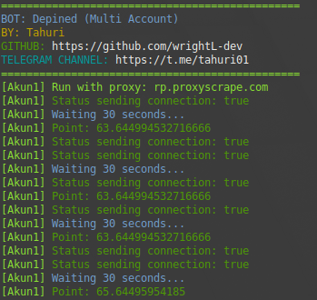

# BOT DEPINED - EXTENSION



**Fitur:**

**• Get Point**

**• Multi Account**

**• Auto send connection**

**• Supports Proxy w/o Proxy**

## Requirements

Before running this project, make sure you have installed:

- Node.js
- npm (Node Package Manager)

## Installation

1. **Clone this repository:**

    ```plaintext
    git clone https://github.com/wrightL-dev/DEPINED
    cd DEPINED

2. **Install the required packages:**

    ```plaintext
    npm install cloudscraper https-proxy-agent

3. **Add accounts in the token.txt file. Example:**

    ```plaintext
    Account1::token
    Account2::token
    Account3::token

4. **If you want to use a proxy, edit the proxy.txt file. Example:**
   ```plaintext
   http://username:password@ip_address:port
   http://username:password@ip_address:port
   http://username:password@ip_address:port

5. **Run the script:**
   ```plaintext
   node main.js

## Support

If you have any questions or need further assistance, feel free to join our Telegram channel at [t.me/tahuri01](https://t.me/tahuri01).

## License

This project is licensed under the [MIT License](LICENSE).
